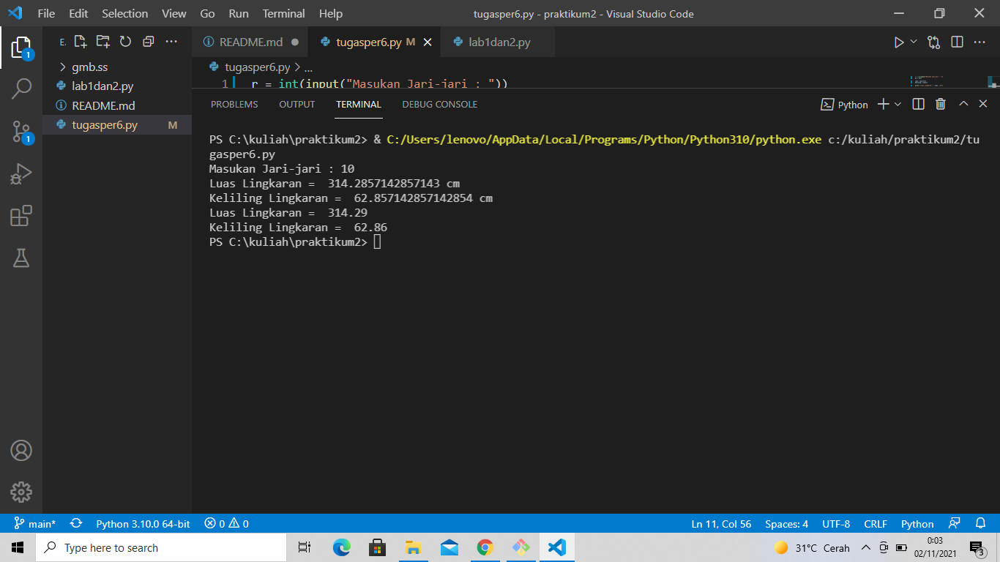
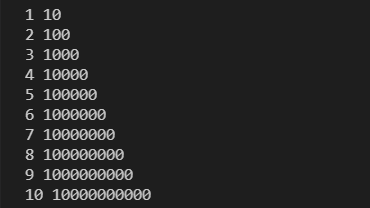

# praktikum2 
## program menghitung luas dan keliling lingkaran

### Rumus Luas & Keliling Lingkaran
Luas     = π(pi) × r²

Keliling = 2 x π(pi) × r

Nilai Phi yang akan kita gunakan adalah 22/7

r merupakan jari-jari lingkaran

Phi merupakan nilai konstanta di matematika sementara jari-jari merupakan jarak antara titik pusat dengan tepi lingkaran.

### Flowchart Menghitung Luas & Keliling Lingkaran

### Program Python Menghitung Luas & Keliling Lingkaran 
INPUT 

r = int(input("Masukan Jari-jari : "))

pi = 22/7

luas = pi*(r*r)

keliling = 2*pi*r

print ("Luas Lingkaran = ",luas,"cm")

print ("Keliling Lingkaran = ",keliling,"cm")

OUTPUT

Masukan Jari-jari : 10
Luas Lingkaran =  314.2857142857143 cm 

Keliling Lingkaran =  62.857142857142854 cm 

Luas Lingkaran =  314.29

Keliling Lingkaran =  62.86

Penjelasan:

Program diatas saya menggunakan phi = 22/7 . Fungsinya supaya saya dapat menyertakan nilai (phi) yang sudah ada .fungsi tersebut maka akan menghasilkan nilai phi = 22/7

Selanjutnya kita memerlukan nilai jari-jari (r) yang nantinya akan di masukan oleh pengguna pada layar console. Kita menggunakan fungsi input() yang nilainya di konversi ke tipe data float (bilangan riil). Ingat bahwa fungsi input() akan menganggap semua nilai inputan bertipe string, sehingga kita perlu melakukan konversi ke tipe yang diinginkan.

Ketika kita sudah mendapat nilai phi dan jari-jari selanjutnya kita bisa menghitung luas dan keliling sesuai dengan rumus-nya masing-masing .

Selanjutnya kita tampilkan hasilnya dengan fungsi print().

Jika dilihat hasil luas dan keliling lingkaran mempunyai angka pecahan yang cukup banyak, untuk mengambil 2 angka pecahan saja kita pakai fungsi format() seperti berikut:

print ("Luas Lingkaran = ",format(luas,'.2f'))

print ("Keliling Lingkaran = ",format(keliling,'.2f'))

Luas Lingkaran          =

Keliling Lingkaran      =

Dengan penggunaan fungsi format(luas,’.2f’) akan menghasilkan 2 angka pecahan saja.

## Penjelasan  dari LAB 1 DAN LAB 2

### Fungsi end
contoh inputan program sebagai berikut 

maka ouput saat run akan seperti berikut

pengunaan end akan menghasilkan huruf kesamping pada (A,B,C) tetapi jika tidak menggunakan end hasilnya huruf akan berbaris kebawah (X,Y,Z)

### Fungsi penggunaan Separator
contoh inputan program sebagai berikut

maka output saat run akan seperti berikut

penggunaan sep=',' akan menghasilkan output dengan pemisah angka yaitu koma

penggunaan sep=" akan menghasilkan output tanpa tanda pemisah antar angka 

penggunaan sep=':' akan mengahasilkan output dengan pemisah angka yaitu titik dua
 
penggunaan sep='-' akan menghasilkan output dengan pemisah angka yaitu strip

### Pengunaan string format
contoh inputan program sebagai berikut

maka output saat run akan seperti berikut

hasil output akan dimulai dari paragraf sebelah kiri dan angka akan terus dikalikan 10 setelah angka sebelumnya

### Penggunaan string format 
contoh inputan program sebagai berikut

maka output saat run akan seperti berikut

hasil output akan dimulai dari paragraf sebelah kanan dan angka akan terus dikalikan 10 setelah angka sebelumnya

### Program penjumlahan dan pembagian
contoh inputan program sebagai berikut 

maka output saat run akan seperti berikut 

saat kita memasukkan nilai pada variabel a dan b maka akan menghasilkan output penjumlahan dan pembagian 

