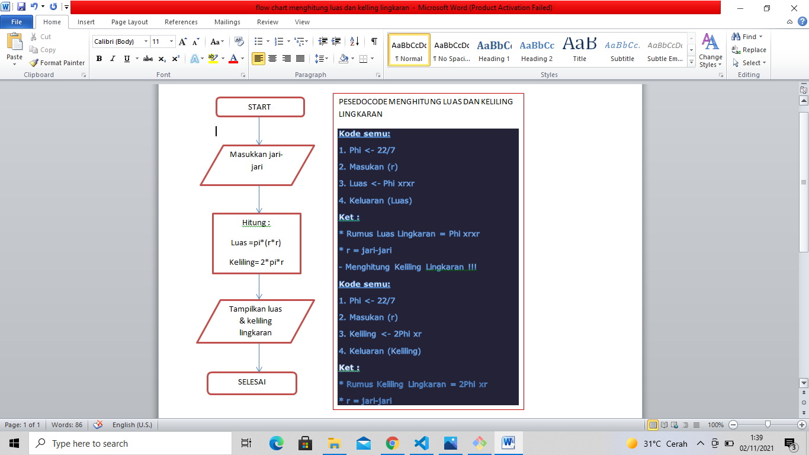
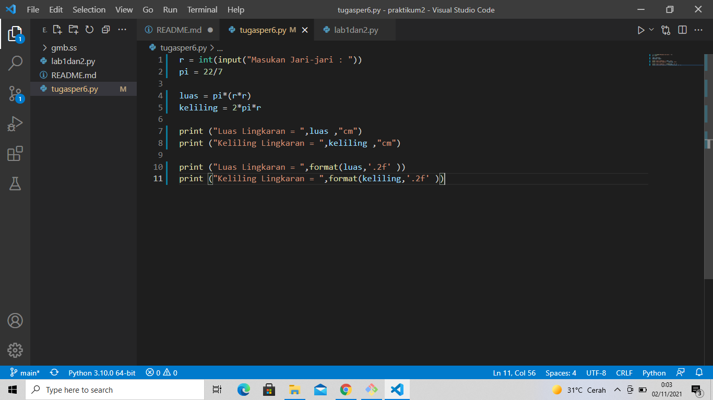

# praktikum2 
## program menghitung luas dan keliling lingkaran

### Rumus Luas & Keliling Lingkaran
Luas     = π × r²

Keliling = 2 x π × r

Nilai Phi yang akan kita gunakan adalah 3.14

r merupakan jari-jari lingkaran

Phi merupakan nilai konstanta di matematika sementara jari-jari merupakan jarak antara titik pusat dengan tepi lingkaran.

### Flowchart Menghitung Luas & Keliling Lingkaran

### Program Python Menghitung Luas & Keliling Lingkaran 
INPUT 

import math

r = float(input("Masukan Jari-jari : "))

luas = math.pi*(r*r)

keliling = 2*math.pi*r

print ("Luas Lingkaran \t\t= ",luas)

print ("Keliling Lingkaran\t= ",keliling)

OUTPUT

Masukan Jari-jari : 10

Luas Lingkaran          =  314.1592653589793

Keliling Lingkaran      =  62.83185307179586

Penjelasan:

Program diatas saya mengimport modul (math) yang sudah di sediakan oleh python. Fungsinya supaya saya dapat menyertakan nilai (phi) yang sudah tersedia dalam modul tersebut dengan perintah (math.pi) jika kita coba mencetak fungsi tersebut maka akan menghasilkan nilai 3.14

import math

print (math.pi)

Selanjutnya kita memerlukan nilai jari-jari (r) yang nantinya akan di masukan oleh pengguna pada layar console. Kita menggunakan fungsi input() yang nilainya di konversi ke tipe data float (bilangan riil). Ingat bahwa fungsi input() akan menganggap semua nilai inputan bertipe string, sehingga kita perlu melakukan konversi ke tipe yang diinginkan.

Ketika kita sudah mendapat nilai phi dan jari-jari selanjutnya kita bisa menghitung luas dan keliling sesuai dengan rumus-nya masing-masing (lihat pada baris ke 3 & 4).

Selanjutnya kita tampilkan hasilnya dengan fungsi print(). sintak \t merupakan karakter espace yang berfungsi untuk membuat tab. dalam kasus ini agar sejajar karakter sama dengan (=) nya.

Jika dilihat hasil luas dan keliling lingkaran mempunyai angka pecahan yang cukup banyak, untuk mengambil 2 angka pecahan saja kita pakai fungsi format() seperti berikut:

print ("Luas Lingkaran \t= ",format(luas,'.2f'))

print ("Keliling Lingkaran \t= ",format(keliling,'.2f'))

Luas Lingkaran          =

Keliling Lingkaran      =

Dengan penggunaan fungsi format(luas,’.2f’) akan menghasilkan 2 angka pecahan saja.

